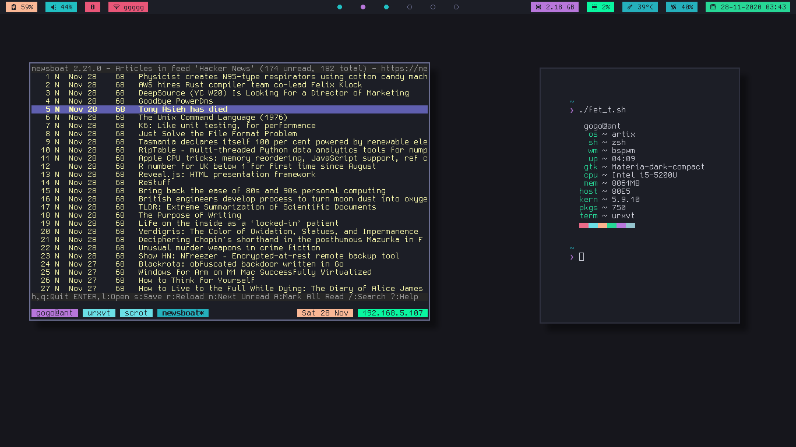
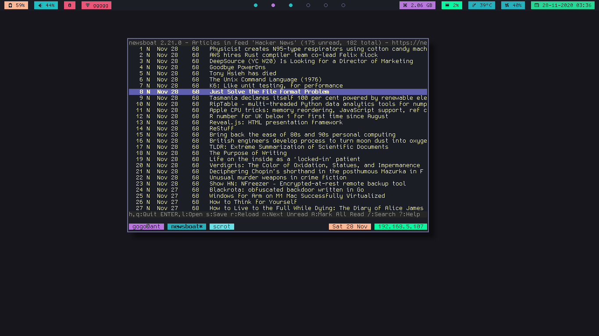

# My dotfiles

#### This is the experimental branch, things are still under construction here

  

## Preview

|     |     |
| ------------------------------------------------------- | ------------------------------------------------------- |
|     |     |
|     |     |
|     |     |

#### Applications

- Terminal: urxvt (truecolor patch)
- Editor: Neovim + LSP(coc.nvim) + a bunch of plugins
- Font: ttyp0 and ttyp0 + Siji for bar
- Window Manager: bspwm
- Compositor: Vanilla Picom
- Bar: Polybar
- GTK Theme: Materia (for now)
- Filemanager: Thunar and Ranger

#### Notes and links for me in case of a new install

* Where I pure the `pure` prompt for `zsh`
* Install `dnscypt`: [dnscypt-proxy](https://wiki.archlinux.org/index.php/Dnscrypt-proxy) and [for atrix](https://wiki.artixlinux.org/Main/Dnscrypt-proxy)
* Update 2020-10-13: Moved to [fnm](https://github.com/Schniz/fnm) from system node version.
