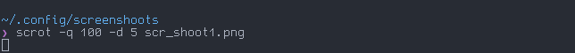
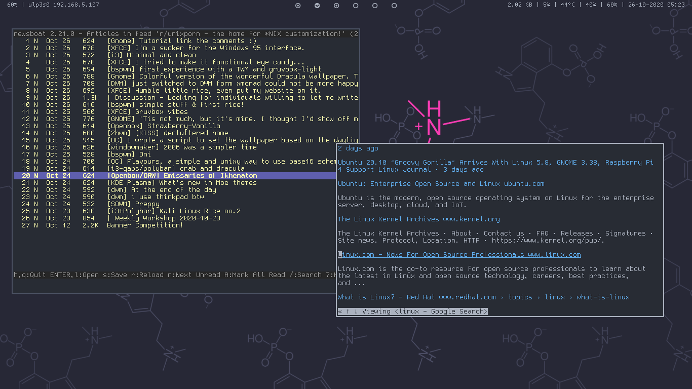
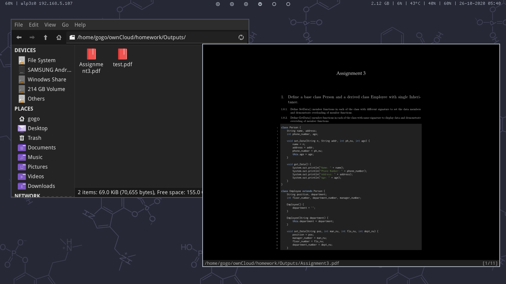

# My dotfiles

#### This is the experimental brach, here things change frequently

## Preview




|    |    |

#### Applications

- Terminal: urxvt (truecolor patch)
- Editor: Neovim + LSP(coc.nvim) + a bunch of plugins
- Music Player: Cmus
- Font: TamzenForPowerline and TamzenForPowerline + Nerd Font Symbols for bar
- Window Manager: bspwm
- Compositor: Vanilla Picom
- Bar: Polybar
- GTK Theme: Materia (for now)
- Filemanager: Thunar and Ranger

#### Notes and links for me in case of a new install

* [Install npm globally without `sudo` on macOS and linux](https://github.com/sindresorhus/guides/blob/master/npm-global-without-sudo.md)
* Where I pure the `pure` prompt for `zsh`

    ```sh
    mkdir -p "$HOME/.config/zsh"
    git clone https://github.com/sindresorhus/pure.git "$HOME/.config/zsh/pure" # it is added to fpath in the promt.zsh file
    ```

* Install vim plug

    ```sh
    sh -c 'curl -fLo "${XDG_DATA_HOME:-$HOME/.local/share}"/nvim/site/autoload/plug.vim --create-dirs \
        https://raw.githubusercontent.com/junegunn/vim-plug/master/plug.vim'
    ```
* Install `dnscypt`: [dnscypt-proxy](https://wiki.archlinux.org/index.php/Dnscrypt-proxy) and [for atrix](https://wiki.artixlinux.org/Main/Dnscrypt-proxy)
* Update 2020-10-13: Moved to [fnm](https://github.com/Schniz/fnm) from system node version.
* Finally fixed the encrypted `SNI` in firefox problem. Also learned that DNSCrypt-Proxy now comes with `DOH`. [Their wiki page](https://github.com/DNSCrypt/dnscrypt-proxy/wiki/Local-DoH), but `network.trr.mode` should be set to `3` instead of `2` to pass the `DNSSEC` on `cloudflare`.
