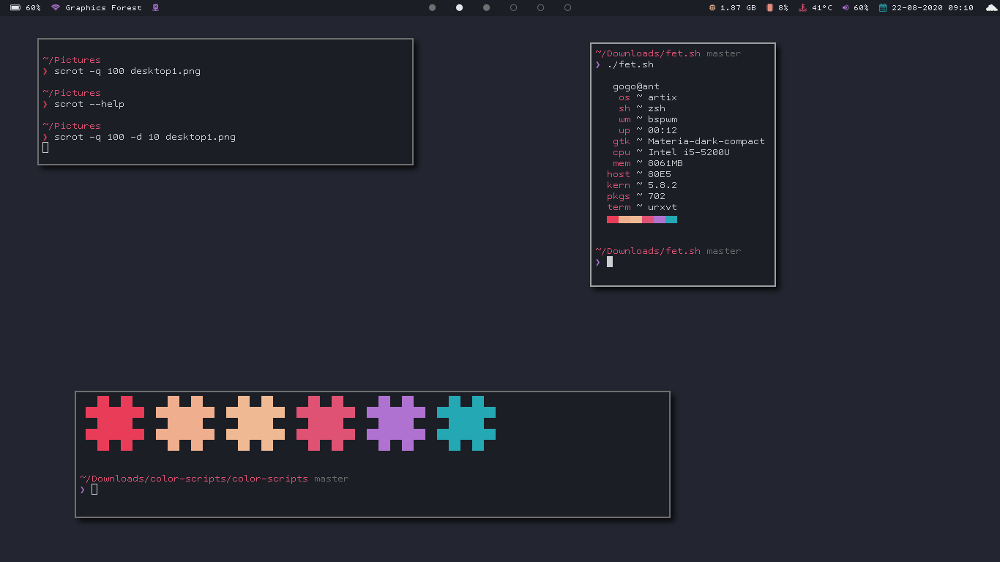
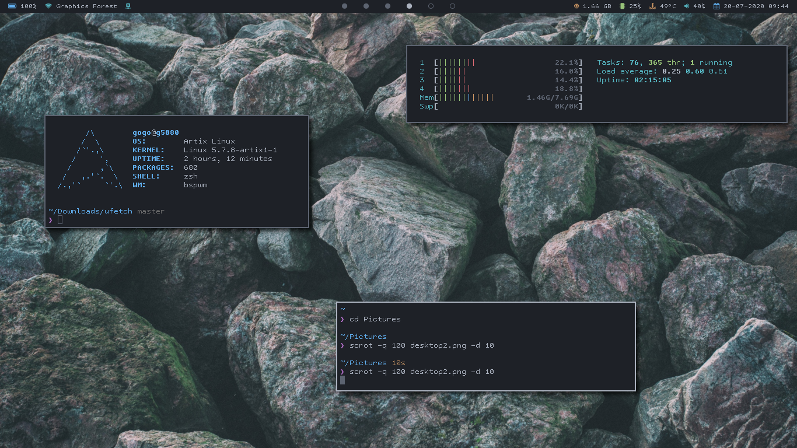

# My dotfiles





#### Applications

- Terminal: urxvt (truecolor patch)
- Editor: Neovim + LSP(coc.nvim) + a bunch of plugins
- Music Player: Cmus
- Font: TamzenForPowerline for terminal and TamzenForPowerline + Nerd Font Symbols for bar
- Window Manager: bspwm
- Compositor: Vanilla Picom
- Bar: Polybar
- GTK Theme: Materia (for now)
- Filemanager: Thunar
- Overall Color Scheme: Onedark

#### Notes and links for me in case of a new install

* [Install npm globally without `sudo` on macOS and linux](https://github.com/sindresorhus/guides/blob/master/npm-global-without-sudo.md)
* Where I pure the `pure` prompt for `zsh`

    ```sh
    mkdir -p "$HOME/.config/zsh"
    git clone https://github.com/sindresorhus/pure.git "$HOME/.config/zsh/pure" # it is added to fpath in the promt.zsh file
    ```

* Install vim plug

    ```sh
    sh -c 'curl -fLo "${XDG_DATA_HOME:-$HOME/.local/share}"/nvim/site/autoload/plug.vim --create-dirs \
        https://raw.githubusercontent.com/junegunn/vim-plug/master/plug.vim'
    ```
